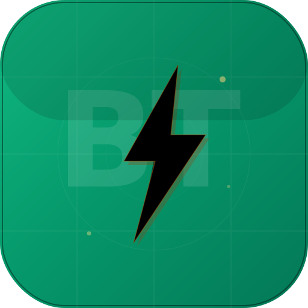

<div align="center">



# BrutalTools Calculator

**A powerful, beautiful scientific calculator with exact value recognition.**

[](https://nextjs.org/)
[](https://www.typescriptlang.org/)
[](https://tailwindcss.com/)
[](https://ui.shadcn.com/)
[](https://www.prisma.io/)
[](LICENSE)

**sin(30°) = 1/2** — because answers should be exact.

</div>

---

## ✨ Features

### Calculator Modes
- **Basic** — Standard arithmetic: add, subtract, multiply, divide, percent
- **Scientific** — 20+ functions: sin, cos, tan (with inverse), log, ln, √, ∛, x², x³, factorial, eˣ, 10ˣ, 1/x, |x|

### Exact Value Recognition
The calculator recognizes common mathematical exact forms and displays them alongside decimal values:

| Input | Decimal | Exact Form |
|-------|---------|------------|
| `sin(30)` | 0.5 | **1/2** |
| `sin(45)` | 0.707106… | **√2/2** |
| `cos(60)` | 0.5 | **1/2** |
| `tan(45)` | 1 | **1** |
| `sin(60)` | 0.866025… | **√3/2** |
| `√(4)` | 2 | **2** |

Works for all standard angles (0°, 15°, 30°, 45°, 60°, 75°, 90°) and their multiples.

### Reference Tables (5 tabs)
- **Trig** — sin, cos, tan values with decimal AND exact forms for 14 angles
- **Log** — log₁₀, ln, log₂ for common numbers with squares and roots
- **Constants** — π, e, √2, √3, φ (golden ratio), and more with descriptions
- **Powers** — n², n³, √n, ∛n, n! for numbers 1–20
- **Conversions** — Degrees ↔ Radians, Temperature (°C/°F/K), Common Fractions

### Calculation History
- Every calculation saved with **exact form** and **mode badge** (Basic/Scientific)
- **Relative timestamps** (just now, 5m ago, 2h ago, yesterday)
- **Copy to clipboard** on any result
- **Click to reuse** any previous result
- Persisted in SQLite database

### Full Keyboard Support
| Key | Action |
|-----|--------|
| `0-9` | Digits |
| `+ - * /` | Operators |
| `Enter` / `=` | Calculate |
| `Escape` | Clear All (AC) |
| `Delete` | Clear Entry (CE) |
| `Backspace` | Delete last digit |
| `( )` | Parentheses |
| `%` | Percentage |

### Smart UX
- **Dynamic AC/CE** — Button toggles between AC (clear all) and CE (clear entry)
- **Auto-close parentheses** — Missing closing parens are automatically added
- **Live expression preview** — See the full expression as you build it
- **Copy result** — Hover to reveal copy button on the display
- **Degree/Radian toggle** — Switch between DEG and RAD mode

### Design
- Dark theme with emerald + amber accent colors
- Framer Motion animations on every interaction
- Glassmorphism card with gradient background
- Responsive: works on mobile, tablet, and desktop
- Custom BrutalTools lightning bolt logo

---

## 🛠 Tech Stack

| Technology | Purpose |
|-----------|---------|
| [Next.js 16](https://nextjs.org/) | React framework with App Router |
| [TypeScript 5](https://www.typescriptlang.org/) | Type safety |
| [Tailwind CSS 4](https://tailwindcss.com/) | Styling |
| [shadcn/ui](https://ui.shadcn.com/) | Component library |
| [Zustand](https://zustand-demo.pmnd.rs/) | State management |
| [Prisma](https://www.prisma.io/) | SQLite ORM for history persistence |
| [Framer Motion](https://www.framer.com/motion/) | Animations |
| [Lucide React](https://lucide.dev/) | Icons |

---

## 🚀 Getting Started

### Prerequisites
- [Node.js](https://nodejs.org/) 18+
- [Bun](https://bun.sh/) (recommended) or npm

### Installation

```bash
git clone https://github.com/your-username/calculator.git
cd calculator
bun install
bun run db:push
bun run dev
```

Open [http://localhost:3000](http://localhost:3000) in your browser.

### Environment Variables

Create a `.env` file:

```env
DATABASE_URL="file:./db/custom.db"
```

---

## 📁 Project Structure

```
src/
├── app/
│   ├── api/calculations/route.ts   # REST API for history CRUD
│   ├── globals.css                  # Global styles + theme
│   ├── layout.tsx                   # Root layout
│   └── page.tsx                     # Main page
├── components/
│   ├── calculator/
│   │   ├── calculator-app.tsx       # Main app shell + layout
│   │   ├── calculator-display.tsx   # Display with exact values
│   │   ├── calculator-keyboard.tsx  # Basic + Scientific buttons
│   │   ├── history-panel.tsx        # History with badges + copy
│   │   └── reference-tables.tsx     # 5-tab reference tables
│   ├── ui/                          # shadcn/ui components
│   └── theme-provider.tsx           # Dark/Light/System theme
├── lib/
│   ├── db.ts                        # Prisma client
│   ├── exact-values.ts              # Exact value recognition engine
│   └── utils.ts                     # Utility functions
├── stores/
│   └── calculator-store.ts          # Zustand state + math engine
prisma/
└── schema.prisma                    # Database schema
```

---

## 🧮 How Exact Values Work

The `exact-values.ts` engine uses a multi-layered matching system:

1. **Expression parsing** — Detects if the expression is a trig function, sqrt, factorial, etc.
2. **Known angle lookup** — Matches standard angles against a table of exact forms
3. **Fraction detection** — Checks if the result is a common simple fraction (1/2, 1/3, 2/3, etc.)
4. **Constant matching** — Recognizes π, e, √2, √3, φ, etc.
5. **Radical simplification** — Detects multiples of surds (√2, √3, √5, etc.)

All matching uses epsilon comparison (1e-9 tolerance) to handle floating-point imprecision.

---

## 📄 License

Developed under **BrutalTools**. MIT License.

<div align="center">
  
  <sub>Built with ⚡ by BrutalTools</sub>
</div>
